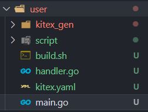
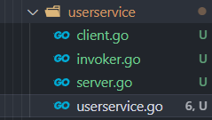

# TinyTiktok项目
## 一、如何测试框架的项目
### 1.首先需要对环境初始化：
- 根据`./cmd/user/initialize/db`内的sql文件进行MYSQL初始化（PS：数据库名建议"TinyTiktok"（shared处可修改））
- 下载etcd，并在一个bash挂机下运行（直接运行即可）。
### 2.启动指令
设定项目路径为当前根目录
#### Run User RPC Server
```bash
cd ./cmd/user
sh build.sh
sh output/bootstrap.sh
```
#### Run API Server
```bash
cd ./cmd/api
go run .
```
### 3.测试
我未经postman测试，根据日志直接在抖声app上测试的。进入抖声直接打开“我的”，随后测试注册、登录以及返回的用户粉丝和关注数(测试值为10)
## 二、service如何插入框架（以我的user模块制作过程为例）
<font color = red>我们默认的根目录为`github.com/xiaohei366/TinyTiktok/`，在开发过程中，后面直接加相对路径</font>
1. 首先在`idl`写好user文件夹下的idl/UserServer.proto文件，对应暴露的接口和服务。随后在cmd文件夹下，创建自己模块的文件夹，并通过定义好的idl文件来自动的生成服务端的微服务框架。
   - 例如指令：`kitex -module github.com/xiaohei366/TinyTiktok -service UserService -I ./../../idl  ./../../idl/UserServer.proto`
   - 此时，若idl文件无误，已生成完整结构
   - 但是为了下次update生成时，需要重复的定义行为，我们将另外在该文件夹下面创建实质的逻辑函数
2. 在相应的cmd文件夹下的文件夹内，添加三个文件夹
   - service--处理微服务的运行逻辑，该文件夹下创立两个文件夹，本地直接创建{{servicename.go}}来处理不同的逻辑（注意创建完，需要添加到handler.go文件中）
     - dal---处理底层数据库函数
     - pack---处理数据库提取后的拼接格式化函数
   - initialize--进行各种初始化的操作
   - configs--存放全局常量、配置微服务所需的结构体等...
3. 先写生成框架的main函数
   - 根据初始化，完成数据库、中间件的init和全局常量的config的书写
   - 随后初始化注册中心并打开服务器

4. 随后书写handler.go（因为是自动生成，因此在这里不主动处理逻辑），主要是逻辑外的格式校验与响应返回

   - 这里的书写也将意味着需要对service中的pack里面的响应做一个方法的封装（例如，对通用响应体(code+message)的方法封装）

5. 在上一步中，因为要书写响应，因此会一步步地完善dal(存放对数据库的操作)、pack(对于handle中响应报文的拼接操作)、service（主要动作逻辑）中的内容。这三部分写完，则代表着整个服务已经完成，但是目前还不可以测试，我们需要完成与主api-server的对接。

   - 这一步在书写时，可以参考easy-note项目中的note部分，你负责的模块有可能需要用到其他人的函数，这时候自行在模块的根目录(例如我是cmd/user)下创建rpc文件夹书写即可。

6. 首先，在cmd/api/biz/rpc下的创建自己模块的go文件（勿忘在init.go进行注册），并根据cmd/api/biz/handler/ApiServer/api_service.go中你负责的接口结构体的所需的数据选择自己微服务服务器开放的响应接口函数，完成初始化。

   - 注意，为了完全解耦，同时保持rpc客户服务端接口的一致性。因此，我们需要将自己模块中的kitex_gen文件夹下的服务文件复制一份到cmd/api/biz/kitex_gen/UserServer。
   - 复制时，需要同时修改如下图所示的文件夹下的四个文件的import路径，改至api路径下。
   - 初始化工作对照自己模块的handler--书写rpc接口
7. 去`cmd/api/biz/router/ApiServer/middleware.go`中设置JWT中间件,这一步主要是JWT鉴权你的token，并允许你使用token中携带的信息（如何使用看注意事项）
   - 其各个函数对应的路由中间件，可以对照`cmd/api/biz/router/ApiServer/middleware.go`

8. 最后去`cmd/api/biz/handler/ApiServer/api_service.go`，书写你服务的处理逻辑。
   - 这里为了方便封装响应报文对应的状态码---特意增加了一个pack.go函数，从里面可以定义你服务的响应报文格式以及响应函数--可参考user。

## 三、注意事项
1. 在请求方request的接口中，不需要定义`token`字段，因为JWT会帮我们处理好（取而代之的就是设置JWT中间件），可以通过下一条注意事项直接从api服务端获得`id`传给微服务端，因此若请求只有一个`token`, 则把他直接换为`id`即可

2. 如何在token中携带信息？如何提取jwt中token中携带的信息

  - 首先要像note项目中，在中间件部分加入鉴权`mw.JwtMiddleware.MiddlewareFunc(),`，这个函数会将信息自动保存在`RequestContext`中

  - `cmd/api/biz/middleware/jwt.go`中的`IdentityHandler`以及`PayloadFunc`负责将信息注入`app.RequestContext`中。（但是请注意，默认携带的是userId，如想带其他的，可以联系我修改Authenticator函数的返回值，从而带上其他的信息）
    - ```go LoginResponse: func(ctx context.Context, c *app.RequestContext, code int, token string, expire time.Time) {
			v, _ := c.Get(shared.IdentityKey) //取出token中储存的信息
			c.JSON(code, utils.H{
				"status_code":   errno.Success.ErrCode,
				"status_msg": "success",
				"user_id": v.(*api.User).Id,//此处演示如何使用
				"token":  token,
			})
		},```
3. 测试说明
   每个人应尽可能记录自己的测试过程，如postman使用哪些案例测试等...
## 四、Git使用说明

【先说大白话】将框架拉到本地后，记得先在本地creat一个新的branch，并且在提交代码时，提交到新的branch里，随后完成代码书写后，最后使用push，届时会自动生成多个分支，reviewer会检查PR，决定合并与否。
**每次提交以及合并的前后，记得要pull一下远程仓库的代码**
【正规来说，一共如下的步骤】
1. 一旦需要开发新的功能，就在`remote`的`master`分支的基础上创建一个`feature xxx`分支
2. 本地创建对应的`feature xxx`分支
3. 每次开发前将`remote库`的`feature xxx`分支拉取到本地，处理冲突
4. 然后在本地`feature xxx`分支上开发，当**开发测试**完毕之后。就`push`到remote的`feature xxx`分支
5. 在项目主页上发起`pull request`（如果是gitlab则是`merge request`，作用相同），本意是提出将`feature xxx`分支合并入`master`分支的请求
