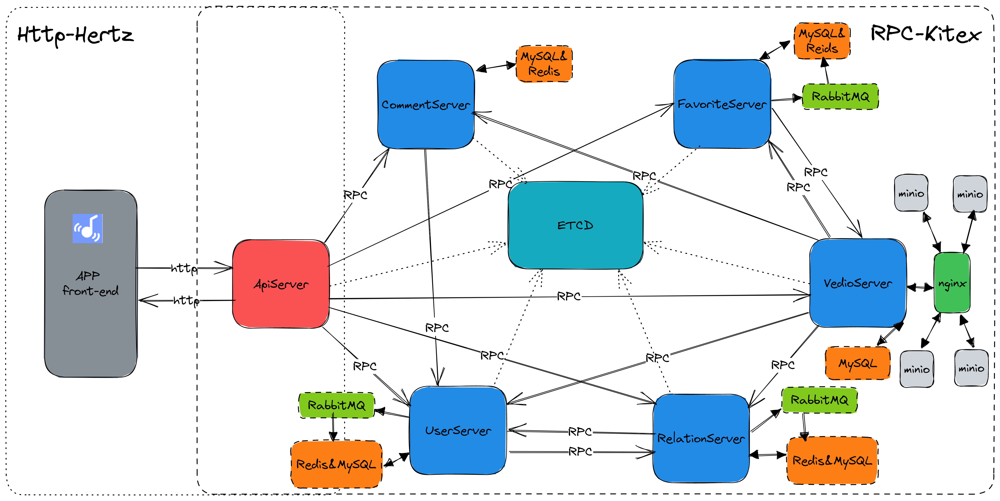

<div align="center">

# TinyTiktok 简易版抖音
</div>


## 1. 项目介绍

本项目基于青训营提供的[抖音项目方案说明](https://bytedance.feishu.cn/docs/doccnKrCsU5Iac6eftnFBdsXTof#K6ToR1)实现接口开发，最终实现[极简抖音App](https://bytedance.feishu.cn/docs/doccnM9KkBAdyDhg8qaeGlIz7S7)的服务端。若想得到本项目更详细的信息，可以阅读该项目的答辩文档[点击此处](https://erkuyiphv6.feishu.cn/docx/N71nd9pDloJVjcxJbNJcRE2mnch)。

## 2. 架构

### 调用关系


### 技术架构


### 服务关系



## 3. 展示

可通过答辩文档里的视频来查看本项目服务端的表现。

该项目的链路追踪结构如下：


## 4. 项目目录介绍

```bash
.
├── cmd #存放提供各个服务的服务器代码
│   ├── api #Api服务器
│   │   ├── biz
│   │   │   ├── handler
│   │   │   │   ├── ApiServer #对应客户端接口的处理逻辑
│   │   │   │   └── pack      #对应客户端接口的响应逻辑
│   │   │   ├── middleware    #存放中间件（目前仅包含jwt组件的相关代码）
│   │   │   ├── model         #Hertz自动生成
│   │   │   │   └── ApiServer
│   │   │   ├── router        #路由
│   │   │   │   └── ApiServer #可在此处加入路由地址所需的中间件
│   │   │   └── rpc           #Api服务器初始化其他服务的RPC客户端
│   │   ├── initialize        #Api服务器的初始化
│   │   ├── main.go           #Api服务器启动设置
│   │   ├── ....              #Hertz自动生成
│   │   └── tmp               #持久化日志
│   │       ├── hlog
│   │       │   └── logs
│   │       └── klog
│   │           └── logs
│   ├── comment  #Comment服务器
│   │   ├── config             #Comment服务器所需的全局变量
│   │   ├── initialize         #Comment服务器的初始化
│   │   │   └── db
│   │   ├── main.go            #CommentRPC服务器的启动设置
│   │   ├── handler.go         #Comment服务器对应RPC接口的处理逻辑
│   │   ├── output             #Comment服务器的启动文件
│   │   │   ├── bin
│   │   │   └── log
│   │   ├── rpc                #Comment服务器初始化其他服务的RPC客户端
│   │   ├── script             #脚本
│   │   ├── service            #Comment服务器所提供服务的业务逻辑
│   │   │   ├── dal            #Comment服务器对数据库的操作
│   │   │   └── pack           #Comment服务器对RPC响应的逻辑封装
│   │   └── tmp                #持久化日志
│   │       └── klog
│   │           └── logs
│   ├── favorite
│   │   ......                #目录结构同上
│   │── video
│   │   ......                #目录结构同上
│   ├── relation
│   │   ├── config            #relation服务器所需的全局变量
│   │   ├── initialize        #relation服务器的初始化
│   │   │   ├── db
│   │   │   ├── mq            #rabbitMQ初始化及其提供的处理逻辑
│   │   │   │   └── amqpclt
│   │   │   └── redis         #redis初始化及其提供的处理逻辑
│   │   ......                #目录结构同上
│   ├── user
│   │   ......                #目录结构同上
├── data                      #对象存储服务的存储目录
├── idl                       #所有RPC服务的idl接口以及ApiServer的Http接口---接口说明书
├── image                     #Readme的图片所在
├── kitex_gen                 #ktex自动生成，提供go语言的idl接口
└── pkg
    ├── configs               #存放该项目运行环境的设置
    │   ├── nginx
    │   ├── otel
    │   ├── redis
    │   └── sql
    ├── errno                  #存放全局设置好的错误码
    ├── middleware             #存放全局都可用的中间件（目前仅含打印日志）
    ├── minio            
    └── shared                 #存放全局都可用的常量
```

## 5. 快速开始

1. 下载ffmpeg完成视频截取图片功能：linux下命令`sudo apt-get install ffmpeg`。
2. 在项目的根目录执行命令`docker-compose up -d`，生成运行环境
3. 在项目的根目录执行命令`go mod tidy`整理go所需要的依赖
4. 修改`./pkg/shared/const.go`的文件，将里面的第一个参数`host_ip`设置为自己内网ip，将第二个参数"minio_ip"设置为公网ip（若本地测试，则这个都设置为内网ip）。
5. 启动ApiServer

```bash
cd ./cmd/user
go run .
```

6. 启动各个服务模块的RPC服务器

- 启动User服务器

  ```bash
  cd ./cmd/user
  sh build.sh
  sh output/bootstrap.sh
  ```

- 启动Video服务器

  ```bash
  cd ./cmd/video
  sh build.sh
  sh output/bootstrap.sh
  ```

- 启动Comment服务器

  ```bash
  cd ./cmd/comment
  sh build.sh
  sh output/bootstrap.sh
  ```

- 启动Favorite服务器

  ```bash
  cd ./cmd/favorite
  sh build.sh
  sh output/bootstrap.sh
  ```

- 启动Relation服务器

  ```bash
  cd ./cmd/relation
  sh build.sh
  sh output/bootstrap.sh
  ```
## 6. 鸣谢
感谢队员：
- [@Jacob1215](https://github.com/Jacob1215)
- [@Vickygaog](https://github.com/Vickygaog)
- [@SkyFa1l](https://github.com/SkyFa1l)

感谢项目主办方
[字节跳动后端青训营](https://youthcamp.bytedance.com/)
  
